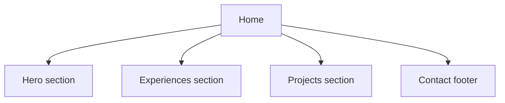

The home page (`src/Home.js`) is the main landing page of the portfolio. It is composed of four distinct sections: a hero, work experiences, projects, and a contact footer.

## Layout overview



## Hero section

The hero displays an animated glitch-style heading and a full-body photo of Patrick.

The heading is rendered as an unordered list (`<ul className="headingText">`) with three `<li>` items — "Hello,", "I'm", and "Patrick" — each using a CSS custom property `--clr` to drive its glitch animation color:

```jsx
<ul className='headingText'>
    <li style={{ "--clr": "#ffdd1c" }}><a href="#" data-text="&nbsp;Hello,">&nbsp;Hello,</a></li>
    <li style={{ "--clr": "#40BB94" }}><a href="#" data-text="&nbsp;I'm">&nbsp;I'm</a></li>
    <li style={{ "--clr": "#4567DB" }}><a href="#" data-text="&nbsp;Patrick">&nbsp;Patrick</a></li>
</ul>
```

The `data-text` attribute on each `<a>` tag mirrors the link text and is used by the CSS pseudo-element (`::before` / `::after`) to produce the chromatic glitch offset effect. The `--clr` custom property sets the highlight color for each word independently.

The full-body photo (`src/images/full.jpg`) is rendered next to the heading inside `.top`.

<Note>
  A wave SVG divider is rendered immediately after the hero `<div className="top">` to provide a visual transition into the experiences section.
</Note>

## Experiences section

The experiences section (`<div className="busSect">`) lists Patrick's work history using `<Work>` components sourced from `src/constants/work.js`.

### Default and expanded states

By default, only the first 2 entries are shown. A toggle button lets visitors expand or collapse the full list:

```jsx
const [currentWorkExperience, setCurrentWorkExperience] = useState(workExperience.slice(0, 2));

const toggleWorkExperience = () => {
    if (currentWorkExperience.length === 2) {
        setCurrentWorkExperience(workExperience);
    } else {
        setCurrentWorkExperience(workExperience.slice(0, 2));
    }
}
```

The button label updates dynamically:

```jsx
<button onClick={toggleWorkExperience}>
    Show {currentWorkExperience.length === 2 ? 'All Experiences' : 'Less'}
</button>
```

### Work component

Each entry renders a `<Work>` component with the following props:

| Prop       | Type   | Description                              |
|------------|--------|------------------------------------------|
| `title`    | string | Job title and company name               |
| `text`     | string | Short description of responsibilities    |
| `image`    | string | Cloudinary URL for company logo/image    |
| `timeLine` | string | Date range and location string           |

For full details on work experience data, see the [Work experience](/pages/experience) page.

## Projects section

The projects section (`<div className="codeSect">`) works identically to the experiences section but renders `<Card>` components sourced from `src/constants/projects.js`.

### Default and expanded states

```jsx
const [projectsToShow, setProjectsToShow] = useState(myProjects.slice(0, 2));

const toggleProjects = () => {
    if (projectsToShow.length === 2) {
        setProjectsToShow(myProjects);
    } else {
        setProjectsToShow(myProjects.slice(0, 2));
    }
}
```

### Card component

Each entry renders a `<Card>` component (distinct from Mintlify's Card — this is a custom component at `src/components/Card.js`) with the following props:

| Prop      | Type     | Description                                      |
|-----------|----------|--------------------------------------------------|
| `title`   | string   | Project name                                     |
| `text`    | string[] | Array of description lines                       |
| `image`   | string   | Cloudinary URL (image or video)                  |
| `isVideo` | boolean  | Render as `<video>` instead of ``           |
| `links`   | object[] | Array of `{ text, href }` link objects           |

For full details on project data, see the [Projects](/pages/projects) page.

## Contact footer

The contact footer (`<div className="bott">`) contains a farewell heading, a copyable email address, and a LinkedIn icon link.

### Email copy-to-clipboard

The component uses two refs to handle the copy interaction:

```jsx
const inputEl = useRef(null);
const copyTextEl = useRef(null);

const handleCopyClick = () => {
    inputEl.current.select();                          // Select the text in the input
    document.execCommand("copy");                      // Execute the browser copy command
    copyTextEl.current.classList.add("active");        // Show confirmation feedback
    window.getSelection().removeAllRanges();           // Clear browser selection highlight
    setTimeout(() => {
        copyTextEl.current.classList.remove("active"); // Remove feedback after 2.5s
    }, 2500);
};
```

The email address is hard-coded as the `value` of a read-only `<input>` element:

```jsx
<input type="text" value='patrick.123.foster@gmail.com' readonly />
<button onClick={handleCopyClick}>Copy</button>
```

<Warning>
  `document.execCommand("copy")` is deprecated in modern browsers. Consider migrating to the `navigator.clipboard.writeText()` API for long-term compatibility.
</Warning>

### LinkedIn icon

A LinkedIn SVG icon is rendered in the footer. Clicking it calls `window.open` to navigate to Patrick's LinkedIn profile in a new tab.

## State summary

| State variable           | Initial value                    | Purpose                                  |
|--------------------------|----------------------------------|------------------------------------------|
| `projectsToShow`         | `myProjects.slice(0, 2)`         | Controls how many projects are visible   |
| `currentWorkExperience`  | `workExperience.slice(0, 2)`     | Controls how many work entries are visible |

## Imports

```jsx
import Work from './components/Work';
import workExperience from './constants/work';
import myProjects from './constants/projects';
import Card from './components/Card';

import PatrickPhoto from './images/full.jpg';
```
